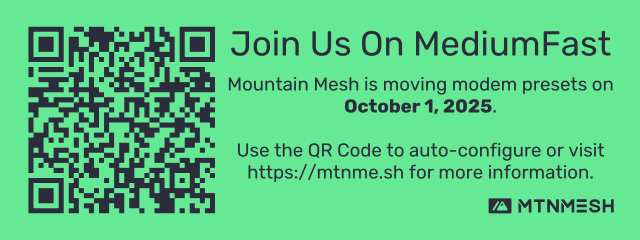

# Migration to MediumFast

**We're flipping our mesh from the default LongFast to MediumFast on October 1, 2025.**

!!! warning
    If you have a filter on your node, make sure it's compatible with the new MediumFast frequency before continuing. LongFast (slot 20) operates at `906.875 MHz`. MediumFast (slot 45) operates at `913.125 MHz`.

[](https://meshtastic.org/e/#CgcSAQE6AggNCg0SAQEaCExvbmdGYXN0EhQIARAEOAFAA0gBUB5oAcAGAcgGAQ)

Click the image above to access the auto-configuration URL or scan the QR code using your phone's camera.

!!! note
    This link will set the following settings:

    - MediumFast LoRa modem preset with frequency slot of 45

    - Hop limit to 5

    - `MediumFast` as primary channel (0) with default PSK of `AQ==`

    - `LongFast` as secondary channel (1) with default PSK of `AQ==`

    This will NOT change your node's network role (Client, Client_Mute, etc.)

## Why We're Moving Modem Presets

All Meshtastic devices default to LongFast out of the box. That's a great preset for getting a small mesh off the ground, but once you get more than 60 nodes chatting in an area, you start getting message collisions. More collisions means dropped packets, network congestion and decreased performance. Considering that some node DBs have more than 200 nodes and channel usage above 45%, we're well past that threshold for migration.

The good news is that this isn't uncharted territory by any means. There are several meshes that have already flipped modem presets. Meshtastic also [posted a post on their blog](https://meshtastic.org/blog/why-your-mesh-should-switch-from-longfast/) detailing when and why a mesh should flip presets.

## Migrating Your Node to MediumFast

There are multiple ways to migrate your node to MediumFast. The easiest way is to use the [QR Code above](https://meshtastic.org/e/#CgcSAQE6AggNCg0SAQEaCExvbmdGYXN0EhQIARAEOAFAA0gBUB5oAcAGAcgGAQ). If that's not your vibe, there are other methods of migration outlined below.

??? note "Back that Node Up"
    Before you start tinkering, it's ALWAYS a good idea to back your current settings up. Thankfully it's easy to do with the [Meshtastic apps](https://meshtastic.org/docs/software/) or the [Meshtastic CLI](https://meshtastic.org/docs/software/python/cli/). Below is a quick way of backing up your node's settings using the CLI:

    ```bash
    meshtastic -t {NODE_IP_HERE} --export-config > node_settings.yml
    ```

    Remember, a backup is usless unless you're able to restore it. To restore your settings, run the following command:

    ```bash
    meshtastic -t {NODE_IP_HERE} --configure node_settings.yml
    ```

### Migrating Options

??? note "Loading from a YAML Configuration"
    If we had to pick, this is our favorite way to migrate settings. We have a condensed YAML configuration file that will only change the specific settings that we tell it to. All you have to do is [download the YAML file](static/mediumfast_config.yml) to your local machine and then and restore the settings.

    Here's an example of how to do that:

    1. [Download the YAML file](static/mediumfast_config.yml) to your local machine or your phone.
    2. Connect to your node using the [Meshtastic CLI](https://meshtastic.org/docs/software/python/cli/) or your app of choice.
    3. Restore the custom configuration you downloaded in step 1. It will only overwrite the settings provided, so your node names and security keys won't be touched.

??? note "Using the Meshtastic CLI"
    This method is pretty straight-forward, for what it's worth. You'll need to install the Meshtastic CLI to accomplish this. You can find the [installation instructions here](https://meshtastic.org/docs/software/python/cli/).

    You can connect to the node via IP, Bluetooth, or Serial. For this example we'll use an IP-based connection.

    ```bash
    meshtastic -t {yourNodeIpHere} --ch-set-url https://meshtastic.org/e/#CgcSAQE6AggNCg0SAQEaCExvbmdGYXN0EhQIARAEOAFAA0gBUB5oAcAGAcgGAQ
    ```

<!-- ??? note "Mobile App Manual Migration"
    Listen, I'm only writing up this section because some of y'all are sadists and like to do things the hard way. You do you, but also why? -->

[See our guide on recommended configurations for additional node settings.](/config)

## Setting up a LongFast Bridge Network

It's totally possible to create a network bridge between the 2 modem presets. You can have 2 radios on the same local area network (LAN) or even have a single linux box connected to 2 radios at once. Check out [this blog post](https://kr4ccz.net/posts/meshtastic/bridge/) for an example on how to run 2 meshtasticd interfaces at the same time using a docker network.
